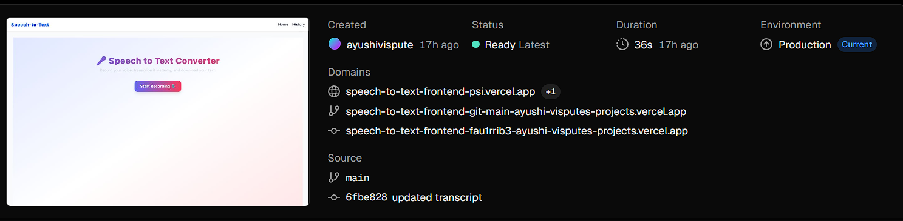

🎨 Speech to Text Frontend

🖥️ Application Interface
<video src="https://github.com/AyushiVispute/speech-to-text-frontend/assets/123456789/Speech to text.mp4" controls width="700"></video>

🎨 Frontend Deployment (Vercel)

This is the frontend of the Speech to Text Web Application, developed using Next.js and Tailwind CSS.
It connects seamlessly to the Flask backend API to convert live audio input into text.

🚀 Live Links
🌐 Frontend (Live): https://speech-to-text-frontend-psi.vercel.app
⚙️ Backend API: https://speech-to-text-backend-a3mh.onrender.com

Key Features:
🎙️ Audio recording directly from the browser
⚡ Fast API integration with live backend
💬 Displays transcribed text dynamically
📱 Fully responsive UI built with Tailwind CSS

🛠️ Tech Stack
Framework: Next.js (React)
Styling: Tailwind CSS
API Calls: Axios / Fetch API
Hosting: Vercel

⚙️ Environment Variable

To connect with the backend API, include this in your .env file:

NEXT_PUBLIC_API=https://speech-to-text-backend-a3mh.onrender.com

✨ Internship Contribution
This frontend was created during my internship to demonstrate:
Clean UI design practices
Integration of frontend with a live Flask backend
Deployment of a full-stack web application using Vercel & Render

🧑‍💻 Author
Ayushi Vispute
📧 [ayushivispute4@gmail.com]
 

